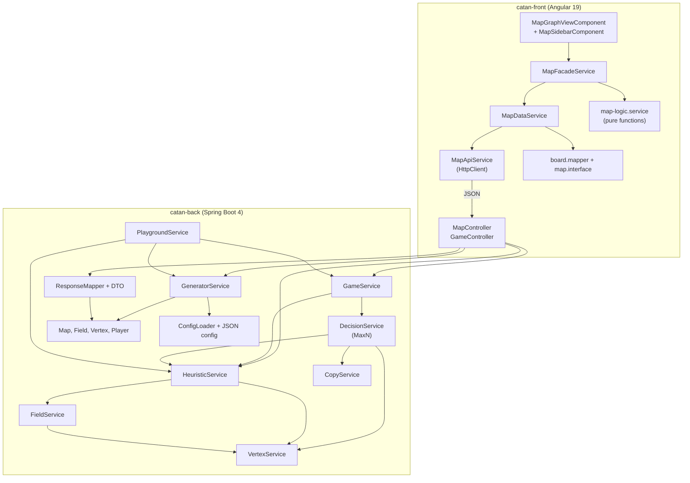

# catan-placement-optimizer

Inteligentni softverski agent za optimizaciju faze početnog postavljanja u društvenoj igri **Settlers of Catan**, razvijen kao deo diplomskog rada na Fakultetu tehničkih nauka u Novom Sadu.

---

## O projektu

Settlers of Catan je kompleksna društvena igra zasnovana na heksagonalnoj mreži od 19 polja, gde svako polje proizvodi jedan od pet resursa (drvo, cigla, ovca, pšenica, ruda). Ovaj projekat se fokusira isključivo na **fazu početnog postavljanja (Placement Phase)**, u kojoj tri igrača postavljaju po dva naselja prema Snake Draft redosledu (`1 → 2 → 3 → 3 → 2 → 1`).

Cilj je razvoj agenta koji primenjuje principe teorije igara i napredne heurističke metode kako bi optimizovao odluke u ovoj fazi.

---

## Tehnološki stack

| Sloj | Tehnologija |
|------|-------------|
| Backend | Java 17, Spring Boot 4 |
| Frontend | Angular 19 (standalone komponente, SSR podrška) |
| Komunikacija | REST API / JSON |
| Build alati | Maven (`catan-back`), npm / Angular CLI (`catan-front`) |

---

## Arhitektura sistema

Sistem je podeljen na dva nezavisna modula koja komuniciraju isključivo preko REST API-ja. Backend drži stanje aktivne table u memoriji; frontend je stateless u odnosu na poslovnu logiku i služi za vizuelizaciju i upravljanje sesijom.

```
catan/
├── catan-back/     # Spring Boot — domen, algoritmi, simulacije
└── catan-front/    # Angular — prezentacija, SVG tabla, analitika
```

### Pregled slojeva



### Backend (`catan-back`)

Paket `com.example.catan` organizovan je po odgovornostima:

```
catan-back/src/main/java/com/example/catan/
├── api/              # REST kontroleri
├── dto/              # JSON ugovor prema frontendu
├── services/         # poslovna logika
├── models/
│   ├── map/          # Map, Field, Vertex, Player
│   ├── enums/        # Resource, Tactic, HeatmapRating
│   └── values/       # Heuristic, Score
├── interfaces/       # GameInterface, HeuristicInterface, MapInterface
├── utils/            # ConfigLoader, MathUtil, MapGeneratorUtil
├── config/           # game.json, heuristic.json, fields.json, vertices.json
└── settings/         # WebConfig (CORS)
```

| Sloj / komponenta | Odgovornost |
|-------------------|-------------|
| **MapController** | Prima listu taktika, generiše mapu, vraća kompletan DTO stanja |
| **GameController** | Izvršava jedan potez po `turnNumber`, vraća ažuriranu mapu i sledeći broj poteza |
| **GeneratorService** | Generiše validnu random mapu (19 polja, ograničenja susedstva), čuva **trenutnu mapu** u memoriji |
| **GameService** | Orkestrira redosled poteza iz `game.json`, poziva odluku agenta i ažurira skor |
| **DecisionService** | MaxN pretraga: bira naselje (top-N kandidata) i put ka planiranom susednom čvoru |
| **HeuristicService** | Računa heuristike po čvoru i igraču, heatmap ocene, evaluaciju za MaxN list |
| **FieldService** | Četiri komponente heuristike na nivou polja (production, diversity, scarcity) |
| **VertexService** | Topologija čvorova, Distance Rule, simulacija poteza |
| **CopyService** | Duboka kopija mape za MaxN grananje (izolacija simulacija) |
| **PlaygroundService** | `ApplicationRunner` — headless batch simulacije i CSV izlaz |
| **ResponseMapper** | Mapiranje domena → DTO (polja, čvorovi, igrači, heuristike) |
| **ConfigLoader** | Učitavanje JSON konfiguracije pri startu aplikacije |

**Domen model** — `Map` je centralni agregat: 19 `Field` objekata, 54 `Vertex` čvora (iz `vertices.json`), 3 `Player` igrača sa taktikom, skorom i listom naselja. Svaki `Vertex` nosi heurističke vrednosti, heatmap ocenu, zastavice puteva i `isSettled` za Distance Rule.

**Stanje sesije** — `GeneratorService` drži referencu na poslednju generisanu mapu. Svi pozivi `/api/game/turn` rade nad tim istim objektom u memoriji servera (nema baze podataka).

### Frontend (`catan-front`)

```
catan-front/src/app/
├── components/
│   ├── map-graph-view/     # glavni ekran (SVG tabla + sidebar)
│   └── map-sidebar/        # kontrole, tabele, dijalog taktika
├── services/map/
│   ├── map-api.service.ts      # HTTP pozivi ka backendu
│   ├── map-data.service.ts     # stanje mape, turn loop, sessionStorage
│   ├── map-facade.service.ts   # fasada za komponente (signals, computed)
│   └── map-logic.service.ts    # čista logika: layout, heatmap boje, analitika
└── models/
    ├── board-api.dto.ts        # TypeScript tipovi API odgovora
    ├── board.mapper.ts         # DTO → CatanMap
    ├── map.interface.ts        # frontend domen
    ├── map.const.ts            # geometrija heksagona, boje resursa
    └── tactic.ts                 # TacticId tipovi
```

| Sloj / komponenta | Odgovornost |
|-------------------|-------------|
| **MapGraphViewComponent** | Kompozicija UI-a; delegira stanje na `MapFacadeService` |
| **MapSidebarComponent** | Izbor taktika, generisanje mape, start/abort igre, tabele metrika |
| **MapFacadeService** | Angular signals/computed: aktivni igrač, heatmapa, winner, SVG viewBox |
| **MapDataService** | API pozivi, asinhroni turn loop (6 poteza), perzistencija u `sessionStorage` |
| **map-logic.service** | Statička topologija table, pozicioniranje heksagona, bojenje heatmape |
| **board.mapper** | Normalizacija API odgovora u `CatanMap` (resursi, čvorovi, igrači) |

Frontend ne implementira odlučivanje agenta — samo prikazuje rezultate koje backend izračuna i vraća u JSON-u.

### Tok podataka

**1. Generisanje mape**

```
Korisnik bira taktike → MapSidebar → MapFacade → MapDataService
  → POST /api/maps/generate
  → GeneratorService.generateNew()
  → HeuristicService.calculateHeuristic()
  → ResponseMapper → JSON
  → board.mapper → CatanMap signal → SVG render
```

**2. Jedan potez u igri**

```
Start game → MapDataService.startGame() → petlja turnNumber 0..5
  → POST /api/game/turn
  → GameService.play()
      → DecisionService.placeSettlement()  [MaxN]
      → DecisionService.placeRoad()
      → HeuristicService.evaluatePlayer()
  → HeuristicService.calculateHeuristic()
  → ažurirani JSON → frontend osvežava mapu i tabele
```

**3. Headless simulacija** (bez frontenda)

```
Spring Boot start → PlaygroundService.run()
  → 6 blokova × 50 partija (sve permutacije taktika po sedištu):
      GeneratorService → GameService (6 poteza) → CSV red
```

### REST API

| Metoda | Putanja | Telo zahteva | Odgovor |
|--------|---------|--------------|---------|
| `POST` | `/api/maps/generate` | `{ "tactics": ["BALANCED", "PRODUCTION_FOCUSED", "SCARCITY_FOCUSED"] }` | `Response` — puna mapa sa heuristikama |
| `POST` | `/api/game/turn` | `{ "turnNumber": 0..5 }` | `GameTurnResponse` — `{ map, nextTurn }` (`nextTurn: null` na kraju) |

Backend radi na `http://localhost:8080`, frontend na `http://localhost:4200`. CORS (`WebConfig`) dozvoljava origin `http://localhost:4200`.

### Perzistencija

| Šta | Gde | Namena |
|-----|-----|--------|
| Aktivna mapa | RAM servera (`GeneratorService`) | Stanje tokom sesije |
| UI sesija | `sessionStorage` (`catan.session.*`) | Mapa i turn broj posle osvežavanja stranice |
| Taktike po sedištu | `localStorage` (`catan.tactics.perSeat`) | Zapamćen izbor pre generisanja |
| Headless rezultati | `playground-results/headless-results.csv` | Statistika simulacija |

---


## Algoritamski pristup

Pošto igru igraju tri igrača, klasični Minimax nije primenljiv. Koristi se:

- **MaxN algoritam** — generalizacija Minimaxа za višekorisničke igre; svaki igrač maksimizuje sopstvenu heurističku vrednost u stablu pretrage
- **Ograničena dubina pretrage** — `maxNDepth: 4` (konfiguracija u `heuristic.json`)
- **Pruning kandidata** — za svaki potez razmatra se top `nMaxCandidates: 5` čvorova po heuristici
- Striktno poštovanje **Distance Rule-a** — postavljanje naselja blokira čvor i sve susedne čvorove (udaljenost najmanje 2 ivice)
- **Simulacija puta** — nakon izbora naselja agent postavlja put ka najboljem susednom čvoru po heuristici (planirano naselje)

Redosled poteza učitava se iz `game.json`: `[0, 1, 2, 2, 1, 0]`.

---

## Heuristički model evaluacije

Za svaki čvor (potencijalno mesto naselja) računaju se četiri komponente:

| Komponenta | Opis |
|------------|------|
| **Production** | Očekivana produkcija resursa (težine brojeva 2–12, posebno 6 i 8; težine resursa po tipu) |
| **Resource diversity** | Nagrađuje pokrivenost različitih tipova resursa |
| **Number diversity** | Nagrađuje raznovrsnost brojeva; penalizuje duplikate istog broja |
| **Scarcity** | Dodatna vrednost za resurse koji su retki na celoj mapi |

Ukupna vrednost pozicije za igrača sa odabranom taktikom:

```
H(s) = w₁ · Production + w₂ · ResourceDiversity + w₃ · NumberDiversity + w₄ · Scarcity
```

Težine `w₁…w₄` zavise od taktike i definišu se u `heuristic.json` (`tacticWeights`). Metrike se skaliraju prema `heuristicScaling` kako bi bile uporedive.

Na mapi se dodatno računaju **heatmap ocene** čvorova (`VERY_LOW` … `VERY_HIGH`) na osnovu normalizovanih ukupnih vrednosti.

---

## Taktike agenta

| Taktika | Strategija |
|---------|------------|
| **BALANCED** | Uravnotežena kombinacija produkcije, diversifikacije i retkosti |
| **PRODUCTION_FOCUSED** | Maksimizacija početne produkcije resursa |
| **SCARCITY_FOCUSED** | Fokus na monopol nad retkim resursima na mapi |

Svaki igrač može imati drugačiju taktiku. U interaktivnom režimu taktike se biraju po sedištu (1., 2., 3. igrač) pre generisanja mape.

---

## Testiranje (headless režim)

`PlaygroundService` pokreće masovne simulacije pri startu aplikacije kada je uključen headless režim:

```properties
# catan-back/src/main/resources/application.properties
playground.headless.enabled=true
```

Izvršava se **300 simulacija** u **6 blokova** od po **50 partija**. Svaki blok koristi drugačiju permutaciju taktičkih profila po sedištu (B = BALANCED, P = PRODUCTION_FOCUSED, S = SCARCITY_FOCUSED):

| Partije | Igrač 1 | Igrač 2 | Igrač 3 |
|---------|---------|---------|---------|
| 1–50 | B | P | S |
| 51–100 | B | S | P |
| 101–150 | P | B | S |
| 151–200 | P | S | B |
| 201–250 | S | B | P |
| 251–300 | S | P | B |

Rezultati se upisuju u CSV:

`catan-back/src/main/resources/playground-results/headless-results.csv`

CSV sadrži taktiku po igraču (`p1_tactic`, `p2_tactic`, `p3_tactic`), po igraču metrike produkcije, diversifikacije, retkosti i ukupnog skora, produkciju resursa po tipu na mapi, kao i indeks pobednika.

Broj partija po taktici podešava se u `game.json` (`gamesPerTactic`, `totalGames`).

### Hipoteze

- **H1:** Balanced taktika ostvaruje prosečno veći ukupni skor u odnosu na Production-focused i Scarcity-focused taktike.
- **H2:** Balanced taktika pokazuje manju standardnu devijaciju u pokrivenosti resursa.

---

## Vizuelni modul (Angular)

- **SVG prikaz** heksagonalne table sa resursima, brojevima i naseljima
- **Heatmapa** — preklapanje boja na čvorovima prema heurističkim ocenama (uključuje/isključuje se u bočnoj traci)
- **Bočna traka** — izbor taktike po sedištu, generisanje/regeneracija mape, pokretanje i prekid sesije
- **Tabelarni prikaz** heurističkih metrika po igraču i produkcije resursa na mapi
- **Korak-po-korak** otkrivanje postavljanja tokom igre (6 poteza)
- Perzistencija izbora taktika i UI stanja u `localStorage`

### Interaktivni režim (podrazumevano)

Korisnik generiše mapu, pokreće sesiju i prati poteze agenta kroz UI. Headless režim radi paralelno samo ako je eksplicitno uključen u konfiguraciji.

---

## Konfiguracija

| Fajl | Sadržaj |
|------|---------|
| `catan-back/.../config/game.json` | Raspodela resursa i brojeva, redosled poteza, broj simulacija |
| `catan-back/.../config/heuristic.json` | MaxN parametri, težine taktika, skaliranje, heatmap pragovi |
| `catan-back/.../config/fields.json`, `vertices.json` | Topologija table i susedstva čvorova |
| `catan-back/src/main/resources/application.properties` | Spring i headless prekidač |

---

## Pokretanje projekta

### Backend

```bash
cd catan-back
./mvnw spring-boot:run
```

Na Windowsu:

```bash
cd catan-back
mvnw.cmd spring-boot:run
```

### Frontend

```bash
cd catan-front
npm install
npm start
```

Aplikacija je dostupna na `http://localhost:4200/`.

---

## Autor

**Veljko** — Softversko inženjerstvo i informacione tehnologije, FTN Novi Sad
